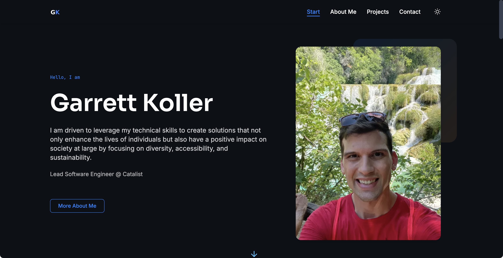

# Astro Multilingual Portfolio Template

[](https://opensource.org/licenses/MIT)

A modern, responsive portfolio website template built with Astro and Tailwind CSS. Features multilingual support, dark/light mode, and optimized performance.


*Note: Replace with actual screenshot of the portfolio*

## Features

- **Modern Design**: Clean, professional design with customizable sections
- **Responsive**: Mobile-first approach ensures it looks great on all devices
- **Dark/Light Mode**: Automatic theme switching based on system preferences with manual toggle
- **Multilingual**: Built-in support for English and German
- **Fast Performance**: Leveraging Astro's static site generation for optimal performance
- **Animation Effects**: Subtle animations enhance the user experience
- **SEO Optimized**: Built-in meta tags and structured data
- **Accessibility**: Designed with accessibility in mind

## Sections

- Header with responsive navigation
- Hero section with call-to-action
- Values/approach section
- Skills & tools overview
- Projects showcase
- Professional timeline/experience
- Contact information
- Customizable footer

## Technology Stack

- **[Astro](https://astro.build/)**: Modern static site generator
- **[Tailwind CSS](https://tailwindcss.com/)**: Utility-first CSS framework
- **[GSAP](https://greensock.com/gsap/)**: Animation library
- **[AOS](https://michalsnik.github.io/aos/)**: Animate on scroll library

## Getting Started

### Prerequisites

- Node.js 16 or higher
- npm or yarn

### Installation

1. Clone this repository
```bash
git clone https://github.com/yourusername/portfolio-website.git
cd portfolio-website
```

2. Install dependencies
```bash
npm install
```

3. Run the development server
```bash
npm run dev
```

4. Open your browser and navigate to `http://localhost:4321`

## Customization

### Personal Information

Update your personal information in the following files:

- `src/i18n/en.json` and `src/i18n/de.json`: Contains all text content in English and German
- Replace images in `src/assets/` with your own

### Theme Colors

Modify the Tailwind configuration in `tailwind.config.mjs` to change the color scheme.

### Adding Projects

Add your projects by editing the project section in the language files.

### Deployment

This site can be deployed to any static hosting service like Netlify, Vercel, or GitHub Pages.

```bash
npm run build
```

This will generate static files in the `dist` directory which can be deployed.

## License

This project is available as open source under the terms of the MIT License.

## Credits

This template was created to serve as a starting point for personal portfolio websites. Feel free to use it for your own projects!
